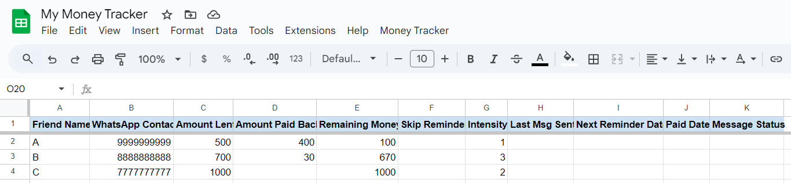

# 🔔 Auto Pay Reminder System

Automated payment reminder tool using **Google Sheets**, **Apps Script**, and **Telegram Bot API**. Generates personalized, click-to-send **WhatsApp links** based on smart logic and reminder schedules — ideal for tracking pending payments or invoices.

---

## 📸 Screenshot

---

## 🔧 Features

- ✅ Fully automated via time-based triggers  
- 📅 Smart filtering based on skip flags, paid status, and custom frequency  
- 📲 WhatsApp message links using [wa.me](https://wa.me)  
- 🤖 Telegram bot delivery for easy manual sending  
- 📊 Google Sheets as your no-code backend

---

## 💼 Use Cases

- Freelancers reminding clients of pending invoices  
- Community or club dues collection  
- Tracking shared expenses or personal IOUs  
- Subscription or membership payment reminders  

---

## 🛠️ Tech Stack

| Component            | Purpose                          |
|---------------------|----------------------------------|
| Google Sheets        | Acts as the structured database  |
| Google Apps Script   | Automation engine (JavaScript)   |
| Telegram Bot API     | Delivers daily batch messages    |
| WhatsApp wa.me       | Pre-fills personalized messages  |

---

## 🚀 Getting Started

### 1. 📄 Copy the Sheet Template

- Use the provided Excel template: `sheets_template/MoneyTrackerTemplate.xlsx`
- Upload it to Google Sheets
- Rename the sheet tab if needed

---

### 2. 🧠 Configure the Script

In `scripts/Code.gs`, update the following config values:

| Variable                   | Description                                 |
|----------------------------|---------------------------------------------|
| `SHEET_NAME`               | Your Google Sheet **name**                 |
| `SHEET_WORKSHEET_NAME`     | Your worksheet/tab name (e.g., `Sheet1`)    |
| `TELEGRAM_BOT_TOKEN`       | Your bot token from [@BotFather](https://t.me/BotFather) |
| `YOUR_TELEGRAM_USER_CHAT_ID` | Your Telegram user ID (use `getUpdates`)     |
| `YOUR_MAIN_WHATSAPP_NUMBER` | Your main number or brand                   |
| `CUSTOM_MESSAGE_TEMPLATE`  | Customize the reminder message              |
| `COL_*` indices            | Ensure they match your Google Sheet columns |

---

### 3. 🔌 Set Up Apps Script

- Open your Google Sheet
- Click `Extensions > Apps Script`
- Paste the code from `scripts/Code.gs` and save
- Refresh the sheet

---

### 4. 📤 Manually Run the Script

- Once saved and refreshed, a new menu called **"Money Tracker"** will appear on the toolbar (beside **Help**)
- Click **Money Tracker**
  - Select **Generate & Send Messages (Manual Run)** to test or run it manually
  - WhatsApp links will be batch sent to your Telegram via your bot

---

### 5. 📅 Set Up Automation Triggers

Go to **Money Tracker > Set Up Automation Triggers**, choose how often reminders should be sent:

- 🔁 `Set Up Daily Trigger` – Run every day at 9 AM  
- 📆 `Set Up Weekly Trigger` – Every Monday at 9 AM  
- 🗓️ `Set Up Bi-Weekly Trigger` – Every 15 days (uses internal logic)  
- 🗓️ `Set Up Monthly Trigger` – On 1st of every month at 9 AM  
- ❌ `Delete All Triggers` – Remove all existing automation

---

## 📂 Folder Structure
---
auto-pay-reminder-system/
├── sheets_template/
│   └── MoneyTrackerTemplate.xlsx
├── scripts/
│   └── Code.gs
├── assets/
│   └── screenshot.png
├── README.md
└── LICENSE

---

## 📄 License

MIT License – Free to use and adapt for personal or commercial projects.

---

## 🙌 Contributions

Feel free to fork, add support for email/SMS, or improve logic and UI. Pull requests welcome!
